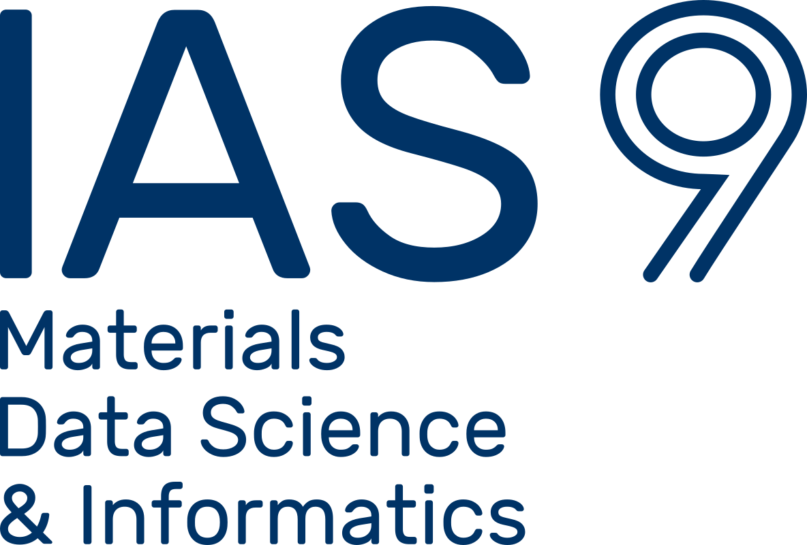

## Welcome to OCDO! :wave:

The Open Crystallographic Defects Ontologies is an initiative that aims to develop standard and interoperable semantics describing crystal defects and adjacent topics such as simulation concepts.

### Ontologies

* **CDOS - Crystallographic Defect Ontology Suite** 
  * CDCO - Crystallographic Defect Core Ontology
  * PODO - Point Defect Ontology
  * LDO - Line Defect Ontology
    * DISO - Dislocation Ontology
  * PLDO - Plane Defect Ontology

* **MMSS - Materials Modelling and Simulation Suite**
  * ASMO - Atomistic Simulation Methods Ontology
  * D3SIM - Discrete Dislocation Dynamics Simulation	

* **CMSO -  Computational Materials Sample Ontology**

### Contributing

OCDO welcomes contributions from domain experts in order to improve the ontologies. 
Feel free to contact us or provide suggestions in a new issue regarding new terms, definitions, synonyms or mapping to relevant ontologies.

### How to use

Under construction :construction:

### Contact

For any questions or feedback, don't hesitate to contact us:

Abril Guzman [:envelope:](mailto:a.azocar.guzman@fz-juelich.de)

### Acknowledgements
This work is developed at the Materials Data Science and Informatics (IAS‑9), Forschungszentrum Jülich GmbH and supported by the [NFDI-Matwerk](https://nfdi-matwerk.de) consortium. (Deutsche Forschungsgemeinschaft (DFG) - Projektnummer 460247524)

 

<!--
**Here are some ideas to get you started:**

🙋‍♀️ A short introduction - what is your organization all about?
🌈 Contribution guidelines - how can the community get involved?
👩‍💻 Useful resources - where can the community find your docs? Is there anything else the community should know?
🍿 Fun facts - what does your team eat for breakfast?
🧙 Remember, you can do mighty things with the power of [Markdown](https://docs.github.com/github/writing-on-github/getting-started-with-writing-and-formatting-on-github/basic-writing-and-formatting-syntax)
-->
